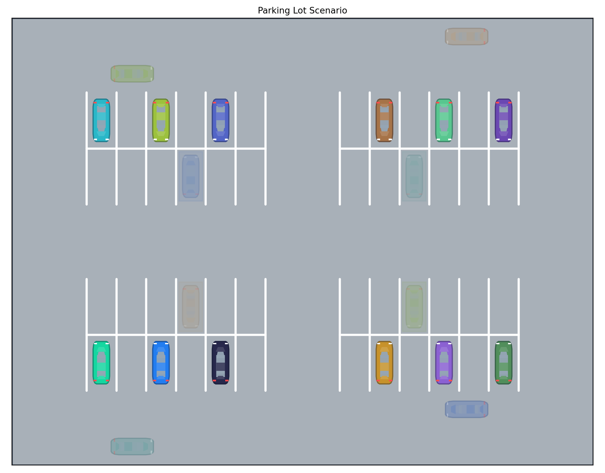
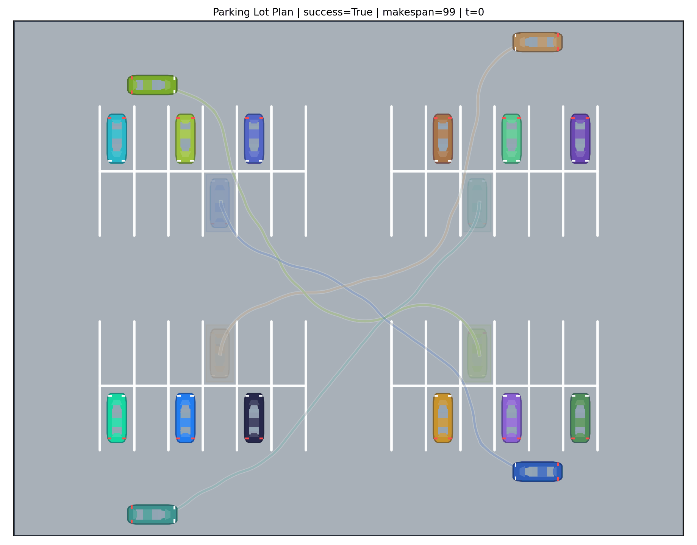

# Parking Lot Planner

Research scaffold for multi-agent, car-like planning in structured parking lots.

## Motivation

Parking lots are a useful coordination setting because they combine:

- tight geometry
- car-like turning-radius constraints
- static parked vehicles
- many interacting goal-directed agents

This repo provides a clean baseline for that setting:

- a fixed parking lot benchmark with reusable geometry
- a footprint-aware low-level planner in C++
- a prioritized planning multi-agent baseline
- Python tools for scenario construction, batch evaluation, and visualization

## Current Planning Stack

- buffered oriented-rectangle collision checking
- time-augmented Hybrid A* for single-car planning
- prioritized planning in fixed YAML order for multi-agent coordination
- batch metrics for success rate, runtime, expansions, and makespan

## Visuals

Scenario:



Solved plan:



## Code Layout

- **Planning core**
  - [include/planner.hpp](include/planner.hpp)
  - [src/planner.cpp](src/planner.cpp)
  - [src/geometry.cpp](src/geometry.cpp)
  - [src/io.cpp](src/io.cpp)
  - [src/main.cpp](src/main.cpp)
- **Examples**
  - [examples/parking_layout.yaml](examples/parking_layout.yaml)
  - [examples/parking_benchmark_config.yaml](examples/parking_benchmark_config.yaml)
- **Scripts**
  - [scripts/build_parking_scenario.py](scripts/build_parking_scenario.py)
  - [scripts/sample_parking_scenarios.py](scripts/sample_parking_scenarios.py)
  - [scripts/evaluate_parking_batch.py](scripts/evaluate_parking_batch.py)
  - [scripts/visualize_parking.py](scripts/visualize_parking.py)
- **Tests**
  - [tests/planner_tests.cpp](tests/planner_tests.cpp)
  - [tests/validate_smoke_output.py](tests/validate_smoke_output.py)

## Quick Start

Create the Python environment for plotting and GIF export:

```bash
python3 -m venv .venv
. .venv/bin/activate
python -m pip install -r requirements.txt
```

Build the C++ code:

```bash
mkdir -p build
cd build
cmake ..
cmake --build .
ctest --output-on-failure
cd ..
```

`ctest` runs the full registered suite, including the core regression tests and the end-to-end smoke tests.

Generate the default runtime scenario:

```bash
python3 scripts/build_parking_scenario.py \
  --layout examples/parking_layout.yaml \
  --config examples/parking_benchmark_config.yaml \
  --output build/parking_benchmark.yaml
```

Run the planner:

```bash
./build/parking_lot_planner \
  build/parking_benchmark.yaml \
  build/parking_benchmark_output.json
```

Export the result as a GIF:

```bash
.venv/bin/python scripts/visualize_parking.py \
  build/parking_benchmark.yaml \
  build/parking_benchmark_output.json \
  --animate \
  --fps 6 \
  --output build/parking_benchmark.gif
```

This writes:

- `build/parking_benchmark.yaml`
- `build/parking_benchmark_output.json`
- `build/parking_benchmark.gif`

## Benchmark Model

The benchmark separates the lot geometry from the cars on the lot.

- [examples/parking_layout.yaml](examples/parking_layout.yaml)
  - reusable lot geometry
  - currently a `2 x 2` grid of parking zones
  - `6` stalls per side
  - `12` spaces per zone
  - `48` spaces total
- [examples/parking_benchmark_config.yaml](examples/parking_benchmark_config.yaml)
  - parked obstacle cars
  - active-agent start poses
  - active-agent goal assignments

`build_parking_scenario.py` compiles those into one flat runtime YAML for the planner.

Each pose is stored as:

- `[x, y, yaw]`

## Runtime Inputs And Outputs

Runtime scenario YAML contains:

- `map`
- `vehicle`
- `planner`
- `parking_layout`
- `static_cars`
- `agents`

Planner JSON output contains:

- `success`
- `runtime_sec`
- optional `failure_reason`
- `metrics`
- `trajectories`

Each trajectory point stores:

- `t`
- `x`
- `y`
- `yaw`

## Batch Workflow

Generate a batch on the same fixed lot:

```bash
python3 scripts/sample_parking_scenarios.py \
  --layout examples/parking_layout.yaml \
  --output-dir batch/scenarios \
  --num-scenarios 50 \
  --num-agents 8 \
  --static-fill-ratio 0.5 \
  --seed 1008
```

Evaluate the batch:

```bash
python3 scripts/evaluate_parking_batch.py \
  --planner build/parking_lot_planner \
  --scenarios batch/scenarios/instances \
  --output-dir batch/results \
  --jobs 3
```

Outputs:

- `batch/results/json/<scenario>.json`
- `batch/results/summary.json`

## Main Metrics

- `success_rate`: fraction of scenarios fully solved
- `avg_runtime_sec`: average end-to-end runtime per scenario
- `avg_expanded_states`: average per-scenario total low-level Hybrid A* expansions
- `avg_makespan_success`: average makespan over successful scenarios only
